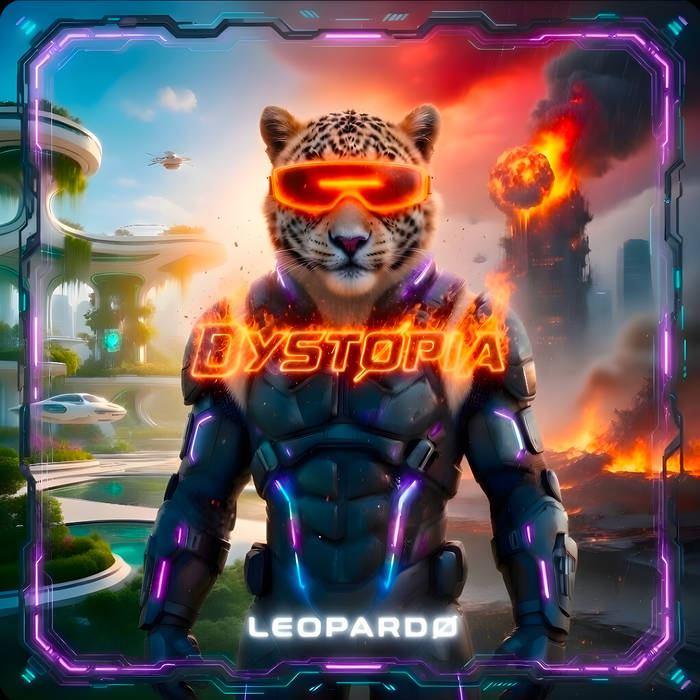

# LEOPARDØ — DYSTØPIA

An immersive, scroll-driven 3D experience for the music of **LEOPARDØ** — built around
the album **DYSTØPIA** (out April 20, 2026). The whole site is a single cinematic journey
that travels the album's narrative arc, **UTØPIA → DYSTØPIA**: a living 3D world whose
color, fog, distortion and bloom decay from a cool, hopeful future into a burning one as
you scroll.

Black, purple and blue. Neon. Dark mode only.



## ✦ Features

- **Fixed 3D world, scrolling content** — a React Three Fiber scene lives behind the page
  and reacts to scroll + pointer (terafab-style adaptive scenes).
- **Scroll-driven narrative** — fog, lights, the album "core," ember intensity and bloom
  all interpolate across a UTØPIA → DYSTØPIA color journey (`src/lib/palette.ts`).
- **The album core** — a molten, distorting icosahedron caged in a neon wireframe shell
  and orbiting rings.
- **Magic Layers in 3D** — holographic panels float at varied depths and parallax against
  the pointer (the spatial counterpart to Canva's Magic Layers).
- **Neon grid horizon, stardust & rising embers** that ignite as the world burns.
- **Postprocessing**: bloom (reactive), chromatic aberration, vignette, film grain.
- **Real content**: all 20 DYSTØPIA tracks, the real **Bandcamp player** embedded in a
  custom neon shell, the discography, the music video, and the artist bio.
- **The album's signature octagonal "tech frame"** reused as a UI system, plus a custom
  smooth-scroll (Lenis), cinematic boot loader, scroll HUD, glitch type and marquees.
- Respects `prefers-reduced-motion` and ships a lighter scene on low-power devices.

## ✦ Tech stack

| Concern        | Tool |
| -------------- | ---- |
| Framework      | React 18 + TypeScript + Vite |
| 3D             | three.js · @react-three/fiber · @react-three/drei |
| Post FX        | @react-three/postprocessing |
| Animation      | GSAP (hero entrance) · IntersectionObserver reveals |
| Smooth scroll  | Lenis |
| State          | Zustand |
| Styling        | Tailwind CSS |
| Type           | Orbitron + Rajdhani (self-hosted via Fontsource) |

## ✦ Getting started

```bash
npm install
npm run dev        # http://localhost:5173
```

Other scripts:

```bash
npm run build      # production build → dist/
npm run preview    # serve the production build
npm run typecheck  # tsc --noEmit
```

## ✦ Project structure

```
src/
  three/            # the 3D world (Experience, Scene, Core, Shards, Particles, Grid, Effects, CameraRig)
  sections/         # page sections (Hero, Manifesto, AlbumShowcase, TrackList, Listen, Video, Discography, About)
  components/
    layout/         # Loader, Navbar, ScrollHud, Footer
    ui/             # TechFrame, NeonButton, SectionHeading, Reveal, MagicLayer, Marquee, GlitchText
  lib/              # smooth scroll, reveal hook, color palette journey, cn()
  store/            # zustand experience store (scroll progress, pointer, ready…)
  data/             # site.ts + music.ts (single source of truth for content)
```

## ✦ Customizing content

Everything is data-driven:

- **Tracks / albums** — edit `src/data/music.ts`.
- **Artist info, links, genres** — edit `src/data/site.ts`.
- **Bandcamp player** — set `dystopia.bandcampEmbedId` (the album's numeric Bandcamp id).
- **Colors / palette journey** — `tailwind.config.js` (brand colors) and
  `src/lib/palette.ts` (the UTØPIA → DYSTØPIA keyframes).
- **Music video** — currently links out to the X premiere
  (`site.links.video`); drop in a YouTube/Vimeo `<iframe>` in
  `src/sections/VideoSection.tsx` when a hosted version exists.

## ✦ Deployment

This is a static Vite SPA — deploy anywhere. Zero-config on **Vercel** or **Netlify**:

- Build command: `npm run build`
- Output directory: `dist`

## ✦ Roadmap ideas

- Self-hosted audio + a WebAudio frequency visualizer wired into the 3D scene.
- A futuristic **posts / promotions** CMS section.
- Per-track 3D scenes and a full video gallery.

---

Music & artwork © LEOPARDØ. Experience crafted in the dark.
